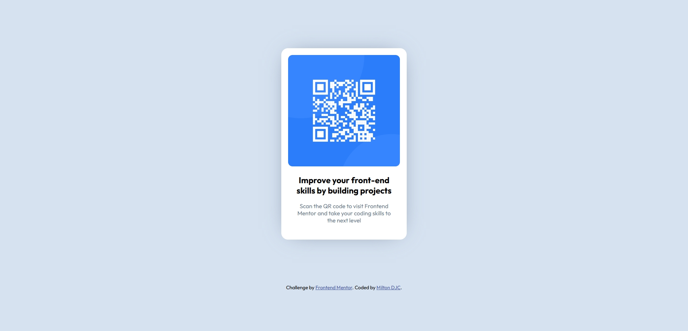

# Frontend Mentor - QR code component solution

This is a solution to the [QR code component challenge on Frontend Mentor](https://www.frontendmentor.io/challenges/qr-code-component-iux_sIO_H). Frontend Mentor challenges help you improve your coding skills by building realistic projects.

## Table of contents

- [Overview](#overview)
  - [Screenshot](#screenshot)
  - [Links](#links)
- [My process](#my-process)
  - [Built with](#built-with)
  - [What I learned](#what-i-learned)
  - [Continued development](#continued-development)
- [Author](#author)

## Overview

### Screenshot

### Links

- Solution URL: [Solution URL](https://your-solution-url.com)
- Live Site URL: [Live Site URL](https://miltondjc.github.io/qr-component-fm/)

## My process

### Built with

- Semantic HTML5 markup
- CSS custom properties
- Flexbox

### What I learned

The most important thing I learned was to control the size of the elements using absolute measurements instead of relative measurements. When I used relative measurements, it was difficult to control the sizes of the container and the position of the elements.

### Continued development

For futures project I want to get better using relative measurements.

## Author

- Frontend Mentor - [@MiltonDJC](https://www.frontendmentor.io/profile/MiltonDJC)
- GitHub - [MiltonDJC](https://github.com/MiltonDJC)
- Linkedin - [Milton De Jesus Coria](www.linkedin.com/in/milton-de-jesus-coria-011749234)
